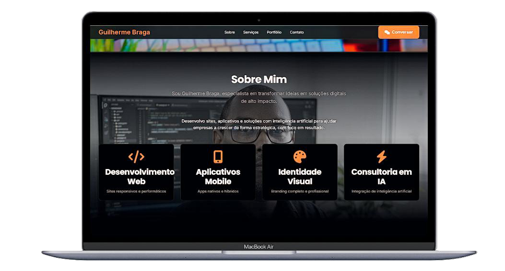

<div align="center">

# ⚡ Guilherme Braga | Portfólio Digital

**Estratégia Digital & Desenvolvimento Tech**

Portfólio profissional desenvolvido com foco em performance, design premium e experiência do usuário.

[](https://guilhermebraga.site)
[](https://wa.me/5522981611821)
[](https://www.linkedin.com/in/guilherme-de-almeida-braga/)
[](https://instagram.com/estudio.braga)

<br>



</div>

---

## 🎯 Sobre o Projeto

Site pessoal e portfólio profissional criado para apresentar meus serviços de **desenvolvimento web**, **aplicativos**, **identidade visual** e **consultoria em Inteligência Artificial** para pequenas e médias empresas brasileiras.

O design segue uma estética **dark premium**, inspirada em sites de agências de alto nível como Linear, Vercel e Stripe.

---

## ✨ Funcionalidades

|
 Recurso 
|
 Descrição 
|
|
---------
|
-----------
|
|
 🎬 
**
Hero com Vídeo
**
|
 Seção inicial com vídeo em background e overlay cinematográfico 
|
|
 📸 
**
Parallax na Seção Sobre
**
|
 Foto pessoal como fundo com efeito parallax e filtro grayscale 
|
|
 🔧 
**
Triple Marquee
**
|
 3 faixas de tecnologias em direções opostas com efeito de fade nas bordas 
|
|
 💼 
**
Portfólio com Hover Premium
**
|
 Cards com efeito 3D (tilt), glow dourado, ripple e shine 
|
|
 📱 
**
Menu Mobile
**
|
 Menu hambúrguer com animação suave e fechamento automático 
|
|
 🌙 
**
Dark Mode
**
|
 Tema escuro completo com paleta de cores em 
`oklch`
|
|
 🚀 
**
Performance
**
|
 Lazy loading de imagens, fontes otimizadas e CSS/JS enxutos 
|
|
 📲 
**
Integração WhatsApp
**
|
 CTAs diretos para conversa no WhatsApp 
|

---

## 🛠️ Tecnologias Utilizadas

<div align="center">


</div>

---

## 📂 Estrutura do Projeto
guilherme-braga/
├── 📁 img/
│ ├── sua-foto.jpg
│ ├── site-dentista.png
│ ├── site-restaurante.png
│ ├── site-salao-beleza.png
│ └── app-parei-aqui.png
├── 📁 video/
│ └── hero.mp4
├── index.html
├── style.css
├── script.js
└── README.md

text

---

## 🚀 Como Rodar Localmente

```bash
# Clone o repositório
git clone https://github.com/braguilweb/guilherme-braga.git

# Entre na pasta do projeto
cd guilherme-braga

# Abra no navegador (ou use o Live Server do VS Code)
open index.html
💡 Dica: Para a melhor experiência de desenvolvimento, instale a extensão Live Server no VS Code.

🎨 Paleta de Cores
Cor	Código	Uso
🟤 Accent (Dourado)	oklch(0.65 0.15 45)	CTAs, ícones, destaques
⚫ Background	oklch(0.08 0.01 280)	Fundo principal
🔲 Card	oklch(0.12 0.015 280)	Fundo dos cards
⚪ Foreground	oklch(0.95 0.01 65)	Textos e títulos
🩶 Muted	oklch(0.70 0.02 65)	Textos secundários
📱 Responsividade
O site é totalmente responsivo e otimizado para:

✅ Desktop (1280px+)
✅ Tablet (768px)
✅ Mobile (480px)
📈 Boas Práticas Aplicadas
✅ SEO — Meta tags, Open Graph e descrições otimizadas
✅ Acessibilidade — Atributos aria-label, alt em imagens, navegação por teclado
✅ Performance — loading="lazy", preconnect, fontes otimizadas
✅ Semântica — HTML5 semântico com tags section, nav, footer
✅ CSS Moderno — Variáveis CSS, oklch, backdrop-filter, mask-image
📬 Contato
Quer trabalhar comigo? Entre em contato!

Canal	Link
💬 WhatsApp	(22) 98161-1821
📧 Email	contato@guilhermebraga.site
📸 Instagram	@estudio.braga
💼 LinkedIn	Guilherme Braga
⭐ Se curtiu o projeto, deixa uma estrela!
Feito com ☕ e dedicação por Guilherme Braga

© 2024 — Todos os direitos reservados.

```